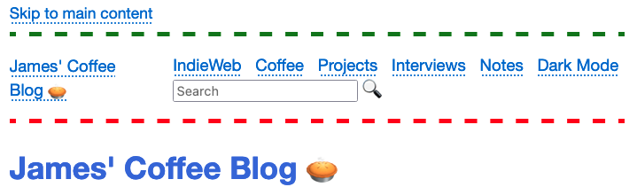

# seasonal.js

Change an emoji on your website for different seasonal events.

## Screenshot

The following screenshot shows the seasonal.js script changing the emoji on my website on a December day:

## License

This project is released into the public domain.

## Contributors

- capjamesg
